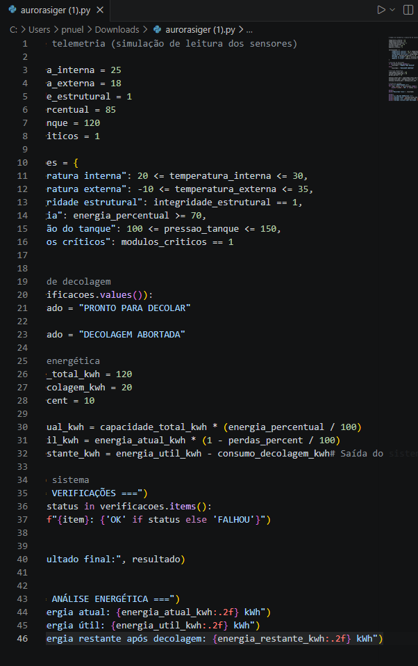
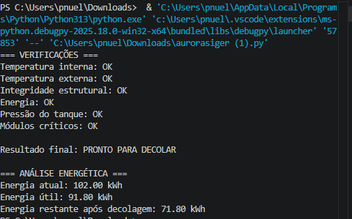

# Relatório Operacional de Pré-Decolagem

## Sobre o projeto

Este projeto simula a verificação de uma nave espacial antes da decolagem utilizando dados de telemetria.
O sistema analisa informações como temperatura, energia, pressão dos tanques e integridade estrutural para decidir se a nave está pronta para decolar.

## Parâmetros analisados

* Temperatura interna
* Temperatura externa
* Integridade estrutural
* Nível de energia
* Pressão dos tanques
* Módulos críticos

## Execução do código

### Código do sistema

### Resultado da execução

## Como executar

1. Instalar Python
2. Baixar este repositório
3. Executar o arquivo:

python sistema_pre_decolagem.py

## Arquivos do projeto

* notebook.ipynb
* sistema_pre_decolagem.py
* README.md

## Autor

Emanuel Rocha Monteiro
